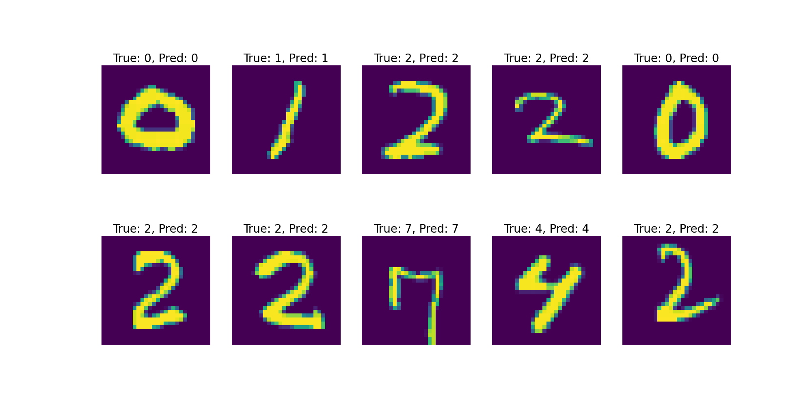

# mnist_clip
基于mnist手写数字训练的clip模型，只能预测0-9

## 使用方法
首先，确保已安装python环境，且安装了pytorch

```bash
conda create -n mnist_clip python=3.10
conda activate mnist_clip
pip3 install torch torchvision --index-url https://download.pytorch.org/whl/cu126
cd mnist_clip
```

## 训练
```bash
python train.py
```

## 预测
```bash
python predict.py
```
得到
```
MNIST预测数据集大小: 10000
已处理: [10/79] 个批次
已处理: [20/79] 个批次
已处理: [30/79] 个批次
已处理: [40/79] 个批次
已处理: [50/79] 个批次
已处理: [60/79] 个批次
已处理: [70/79] 个批次

总样本数: 10000
正确预测: 9902
准确率: 0.9902 (99.02%)
```

## 推理
```bash
python inference.py
```
随机选取MNIST测试集中的10张图片进行预测，得到的结果如图



## GUI界面
```bash
python GUI.py
```
在Trinker界面上用鼠标描绘要预测的数字